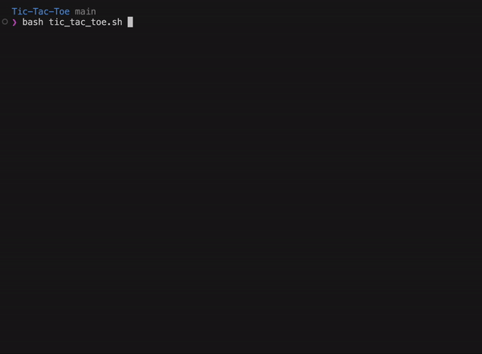

# Tic-Tac-Toe
There are 3 options to play:
- 2 users (starts with X)

- with computer (random moves)
    
- resume stopped game
    

To stop game use CRL+C, history is stored in a file (default `last_game.txt` - may be changed to `~/last_game.txt`) 

Resume is available for both multiuser and computer option

To choose option write **numbers** - no need to press ENTER

Input is validated to be between **1-9** and field to be available (with retry if missclick)

If game is finished (draw or win) it is not saved after pressing CRL+C to be resumed 

There is no validation of history of the game file other than a file exists
